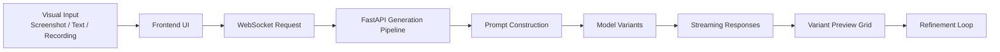
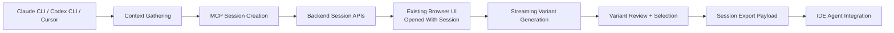
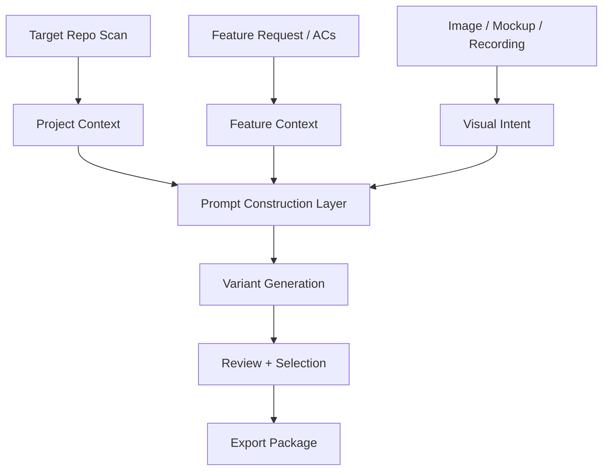
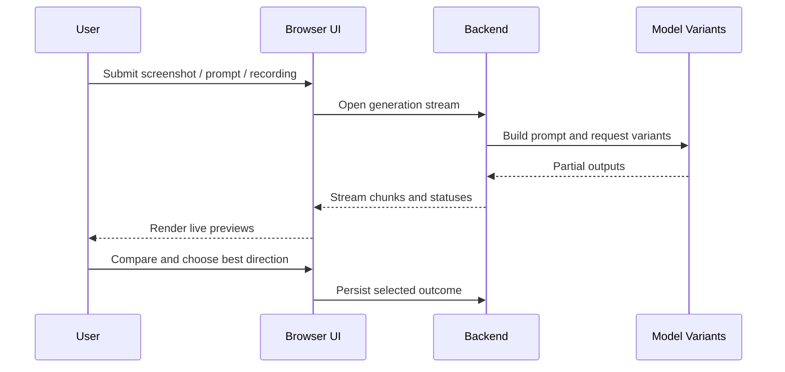

# VUHL UI Forge

`VUHL UI Forge` (`vuhl-ui-forge`) is a unified design-to-code workbench built from the open-source [`abi/screenshot-to-code`](https://github.com/abi/screenshot-to-code) engine and extended for project-aware workflows.

The project is organized around a straightforward idea: fast visual generation is most useful when it stays interactive, streams continuously, and can absorb real context from the codebase it is meant to integrate with. The goal is not only to turn screenshots into code, but to turn visual intent into implementation-ready artifacts that can be reviewed in the browser and then handed back to an IDE agent for clean integration.

## Core Strengths

The strongest parts of the project today are:

- live, streaming multi-variant generation rather than one-shot blocking output
- support for screenshots, text prompts, and recordings as design input
- a browser-first review loop that makes fast comparison practical
- a session-backed path for carrying context and results across browser and MCP workflows
- a unified repo structure that keeps the standalone web app and MCP direction together
- a clear upgrade path from generic generated markup toward context-aware, framework-aware integration

## Repo Layout

This repo is the canonical home for `VUHL UI Forge`.

- `frontend/` - React/Vite browser application
- `backend/` - FastAPI generation engine, model/provider pipeline, and session APIs
- `mcp/` - MCP-oriented package for session-aware orchestration on top of the existing browser app and backend

## Primary Modes

### Standalone Web App

Use the standalone web app when the goal is rapid visual drafting and iteration.

Typical path:

- open the browser UI
- provide a screenshot, prompt, or recording
- stream multiple variants
- compare results visually
- continue refining in the same loop

This is the direct evolution of the upstream screenshot-to-code experience.

### MCP-Driven Workflow

Use the MCP path when an IDE agent such as `Claude CLI`, `Codex CLI`, or `Cursor` should participate in the loop.

Typical path:

- an IDE agent gathers codebase context
- the MCP creates a design session
- the existing browser UI opens with that session attached
- the user reviews streamed variants
- an approved result is exported back to the IDE agent as structured output for integration

The MCP path does **not** create a second browser application. It orchestrates the existing `frontend/` experience and uses backend session APIs as the shared source of truth.

## Supported Generation Targets

- HTML + Tailwind
- HTML + CSS
- React + Tailwind
- Vue + Tailwind
- Bootstrap
- Ionic + Tailwind
- SVG

## Supported Models

- Gemini 3 Flash and Pro
- Claude Opus 4.5
- GPT-5.3, GPT-5.2, GPT-4.1
- other configured providers supported by the backend
- DALL-E 3 or Flux Schnell for image generation

## Why The Streaming Architecture Matters

The central architecture choice in `VUHL UI Forge` is the streaming feedback loop.

Traditional UI drafting tends to degrade in a few ways:

- static mockup handoff strips out implementation context
- one-shot generation makes every iteration expensive
- long blocking waits reduce comparison and refinement speed
- the final output is often a dead-end artifact instead of something that can be integrated

`VUHL UI Forge` addresses that by keeping the generation loop interactive:

- variants arrive incrementally instead of only at the end
- the user can review and compare while the system is still producing output
- context can be gathered before generation rather than bolted on afterward
- selected output can be preserved as a structured session result

That is what makes the system more effective for high-fidelity, fast-turn UI work than a plain screenshot-to-markup tool.

## Architecture Diagrams

### Standalone Generation Flow



### Session-Backed MCP Flow



### Context Ingestion Pipeline



### Real-Time Review Loop



## Current MCP Surface

The current MCP direction is session-oriented and built around the unified repo’s backend session APIs and existing browser interface.

Current tool direction:

- `start_design_session`
- `provide_context`
- `open_design_ui`
- `get_design_results`
- `list_design_sessions`
- `select_design_variant`
- `quick_design`

These tools are intended to make the browser review loop accessible from an IDE-driven workflow rather than replace it.

## In-Progress Goals

The project is still actively moving toward a more complete context-aware integration model. Current goals in progress include:

- real-time rendering and review workflows for Angular-oriented output
- deeper context ingestion from target repositories
- a seamless context methodology that carries project context, feature context, and visual intent into prompt construction
- a browser + MCP dual workflow where the same underlying UI can serve both standalone users and IDE-driven sessions
- export paths that return structured results suitable for agent-driven integration
- continued adaptation of the local fork while selectively incorporating useful upstream improvements

## Getting Started

The app has a React/Vite frontend and a FastAPI backend.

Required API keys:

- OpenAI, Anthropic, or Gemini
- multiple keys are recommended if you want to compare model outputs

Backend:

```bash
cd backend
echo "OPENAI_API_KEY=sk-your-key" > .env
echo "ANTHROPIC_API_KEY=your-key" >> .env
echo "GEMINI_API_KEY=your-key" >> .env
poetry install
poetry env activate
poetry run uvicorn main:app --reload --port 7001
```

Frontend:

```bash
cd frontend
yarn
yarn dev
```

Open `http://localhost:5173` to use the browser UI.

If you prefer a different backend port, update `VITE_WS_BACKEND_URL` in `frontend/.env.local`.

## Docker

```bash
echo "OPENAI_API_KEY=sk-your-key" > .env
docker-compose up -d --build
```

## Upstream Relationship

This repo is intended to remain compatible with continued learning from the upstream engine:

- upstream engine: `https://github.com/abi/screenshot-to-code`

The long-term goal is to keep incorporating useful upstream improvements while evolving `VUHL UI Forge` toward context-aware, integration-ready workflows.

## License

MIT
