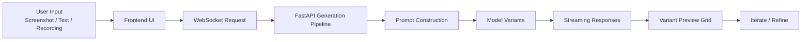
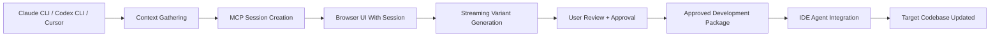
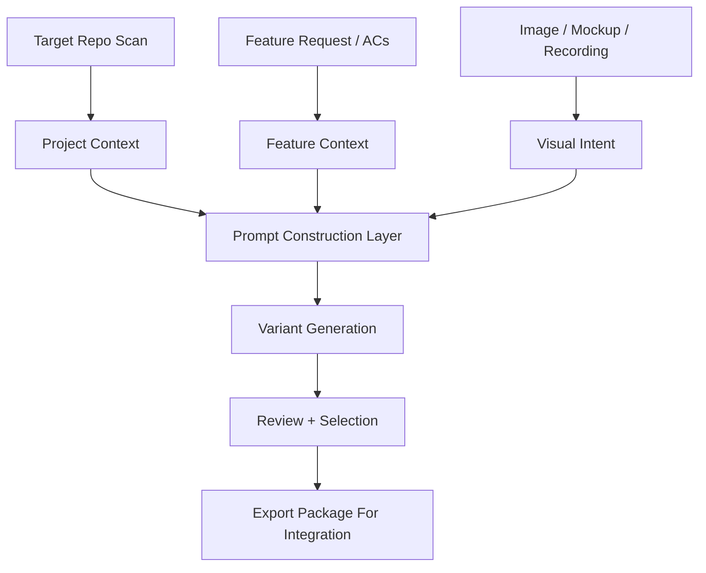

# VUHL UI Forge

`VUHL UI Forge` (`vuhl-ui-forge`) is a unified design-to-code workbench built from the open-source [`abi/screenshot-to-code`](https://github.com/abi/screenshot-to-code) engine and extended for project-aware workflows.

Instead of treating "screenshot to code" as the product name, this repo positions that capability as one engine inside a broader toolchain:

- screenshot and mockup generation
- text and recording-based generation
- iterative edit flows
- future MCP and IDE-driven workflows
- codebase-aware Angular and component integration

## What This Repo Contains

This repo is now the canonical home for the VuhluiForge codebase.

Top-level structure:

- `frontend/` - React/Vite application
- `backend/` - FastAPI backend and model/provider pipeline
- `mcp/` - VuhluiForge MCP package and project-aware workflow layer

## Two Ways To Use It

### Standalone Web App

Use the web app when you want a fast design-to-code workspace without needing an IDE-driven orchestration loop.

Flow:

- open the web UI
- provide a screenshot, text prompt, or recording
- stream multiple variants live
- inspect and iterate in the browser

This is the direct evolution of the upstream engine experience.

### MCP-Driven Workflow

Use the MCP path when you want `Claude CLI`, `Codex CLI`, or `Cursor` to participate in a project-aware workflow.

Flow:

- an IDE agent gathers codebase context
- the MCP creates a design session
- the browser UI opens with context attached
- the user reviews streamed variants and approves one
- the approved result is exported back to the IDE agent as an integration package

This is the main VuhluiForge differentiator.

The MCP path does **not** introduce a second browser UI. It orchestrates the existing `frontend/` app by creating sessions and opening that same UI with session context attached.

## Supported Output Stacks

- HTML + Tailwind
- HTML + CSS
- React + Tailwind
- Vue + Tailwind
- Bootstrap
- Ionic + Tailwind
- SVG

## Supported Models

- Gemini 3 Flash and Pro
- Claude Opus 4.5
- GPT-5.3, GPT-5.2, GPT-4.1
- Other configured providers as supported by the backend
- DALL-E 3 or Flux Schnell for image generation

## Getting Started

The app has a React/Vite frontend and a FastAPI backend.

Required API keys:

- OpenAI, Anthropic, or Gemini
- multiple keys are recommended if you want to compare model outputs

Backend:

```bash
cd backend
echo "OPENAI_API_KEY=sk-your-key" > .env
echo "ANTHROPIC_API_KEY=your-key" >> .env
echo "GEMINI_API_KEY=your-key" >> .env
poetry install
poetry env activate
poetry run uvicorn main:app --reload --port 7001
```

Frontend:

```bash
cd frontend
yarn
yarn dev
```

Open `http://localhost:5173` to use the app.

If you prefer a different backend port, update `VITE_WS_BACKEND_URL` in `frontend/.env.local`.

## Docker

```bash
echo "OPENAI_API_KEY=sk-your-key" > .env
docker-compose up -d --build
```

## MCP Direction

The `mcp/` area is where `VUHL UI Forge` adds project-aware workflows on top of the core design-to-code engine.

The goal is not just generating code from an image, but generating code that fits an existing codebase by incorporating:

- Angular version and conventions
- selector prefixes
- shared components
- service availability
- CSS variables and design tokens
- feature-specific integration context

Current MCP tool direction in the unified repo:

- `start_design_session`
- `provide_context`
- `open_design_ui`
- `get_design_results`
- `list_design_sessions`
- `select_design_variant`
- `quick_design`

These tools are session-oriented wrappers around the unified repo's browser UI and backend session APIs.

## Why The Streaming Loop Matters

Traditional UI spec drafting is often slow and lossy:

- static mockup handoff loses implementation context
- one-shot generation forces long waits and brittle prompts
- the final artifact is often a screenshot or vague spec instead of an integratable package

`VUHL UI Forge` takes a different path:

- variants stream live instead of arriving all at once
- the user can compare options immediately
- project context improves prompt quality before generation starts
- the approved result can be handed back to an agent for clean integration

That combination is what makes it better for high-fidelity UI work than a plain prompt-to-HTML tool.

## System Diagrams

### Standalone Generation Loop



### MCP-Assisted Approval Loop



### Context-Aware Prompt Pipeline



## Target Outcome

The target end state is:

- standalone web app remains useful on its own
- MCP mode becomes the project-aware path for real implementation work
- approved renders turn into structured integration packages instead of dead-end mockups
- upstream engine improvements can still be pulled in without rebuilding the whole product

## Upstream Relationship

- Upstream engine: `https://github.com/abi/screenshot-to-code`

The intent is to keep pulling ideas and improvements from upstream while evolving VuhluiForge toward project-aware implementation workflows.

## Related Docs

- `C:\dev\Obsidian_Notes\VU-Obsidian\Projects\VUHL UI Forge\VUHL UI Forge Status.md`
- `C:\dev\Obsidian_Notes\VU-Obsidian\Projects\screenshot-to-code\screenshot-to-code.md`
- `C:\dev\Obsidian_Notes\VU-Obsidian\Projects\screenshot-to-code-mcp\screenshot-to-code-mcp.md`
